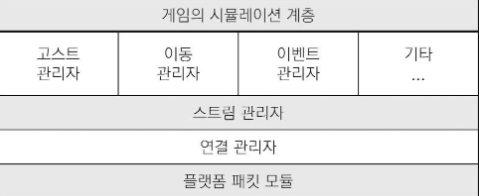

# 네트워크 게임의 개요

## 멀티플레이어 게임의 간추린 역사
### 1. 로컬 멀티 플레이어 게임
1. Tennis for Two(1958)
2. Spacewar!(1962)

### 2. 초기 네트워크 멀티 플레이어 게임
1. Empire (1973)
2. Maze War (1973)

### 3. MUD: 멀티 유저 던전
1. MUD (1987)

### 4. 랜게임
1. Doom (1993)

### 5. 온라인 게임
1. Quake (1996)
2. Unreal (1998)

### 6. MMO 게임
1. Habitat (1986)
2. Ultima Online (1997)
3. Everquest (1999)
4. World of Warcraft (2004)

### 7. 모바일 네트워크 게임
1. Words with Friends (2009) - 모바일 비동기 멀티 플레이어 게임
2. Hearthstone: Heroes of Warcraft (2014) - 실시간

## <스타시즈: 트라이브스>
- 1986년 말에 출시된 SF장르 FPS
- 최대 128명까지 접속 가능한 게임 모드를 제공
- 비신뢰성 프로토콜 사용
  - 네트워크로 보낸 데이터가 수신자에게 반드시 도착한다는 보장이 없음
- 모든 정보를 비신뢰성으로 할수 없기에 데이터 종류에 따라 어떻게 보낼지 네 가지로 구분
  1. 전달 미보장 데이터
     - 중요하지 않은 데이터
     - 데역폭이 고갈되면 게임 시스템에서 먼저 생략하는 데이터
  2. 전달 보장 데이터
     - 수신이 보장되어야 함
     - 데이터가 보낸 순서대로 도착해야 함
     - 예로는 플레이어가 총을 발사했다는 이벤트
  3. 최신 상태 데이터
     - 최신 상태가 아니면 전달할 의미가 없는 성격의 데이터
     - 예로는 플레이어 체력 수치
  4. 특급 전달 보장 데이터
     - 최우선으로 보내야함
     - 전달이 보장되어야 함
     - 시간이 지체될 수록 정보의 가치가 급격히 떨어짐
     - 예로는 플레이어 위치 정보
- 네트워크 게임 설계시 가장 먼저 정해둘 것 : 통신 프로토콜
  - [인터넷의 원리와 주로 사용되는 프로토콜](/Chapter/Chapter2.md)
  - [버클리 소켓](/Chapter/Chapter3.md)
- 피어-투-피어 대신 클라이언트-서버 모델을 채택
  - P2P 모델은 O(n^2)의 대역폭 필요
    - 사용자 수의 제곱에 비례하여 대역폭이 소모
  - CS 모델은 서버만 O(n) 대역폭을 처리하면 됨

- 아래는 트라이브스 네트워킹 모델의 주요 구성요소이다.

### 1. 플랫폼 패킷 모듈
- 패킷 : 네트워크로 보내기 위해 데이터를 묶어 놓은 한 단위
- 플랫폼 패킷 모듈 : 트라이브스 모델 최하위 계층
- 표준 소켓 API를 래핑해둔 것
  - 다양한 패킷 형식을 조립하고 전송하려는 목적으로 래핑
- 트라이브스 개발자들은 신뢰성 계층 직접 구현함
  - 플랫폼 패킷 모듈에서 하는 것은 아님
  - 상위 계층의 고스트 관리자, 이동 관리자, 이벤트 관리자가 신뢰성 관련된 처리를 나누어 담당

### 2. 연결 관리자
- 두 컴퓨터 사이의 연결을 추상화 하는 것
- 윗단의 스트림 관리자가 내려주는 데이터를 받아 아랫단인 플랫폼 패킷 모듈로 전달
- 연결 관리자 수준에서도 여전히 신뢰성을 보장하지 않음
  - 대신 DSN(Delivery Status Notification : 배달 상태 통지)을 보장
  - 맡긴 패킷이 전달되었는지 여부까지만 연결관리자가 확실히 알려줌
  - 상태 통지를 확인하면 상위 계층 관리자(스트림 관리자)는 특정 데이터가 무사히 전달되었는지 판단할 수 있음
  - DSN은 수신 측의 확인응답에 따라 비트 필드를 이용한 슬라이딩 윈도우 기법으로 구현

### 3. 스트림 관리자
- 상위 관리자를 대신하여 데이터를 하위 계층인 연결 관리자에 보내는 것
- 허용 최대 데이터 전송률을 조절하는 것이 중요함
  - 전송률은 인터넷 연결 품질에 좌우
- 최대 전송 빈도와 크기는 서버에 접속할 때 클라이언트가 알려줌
  - 서버가 데이터를 너무 많이 보내 과부하를 주지 않도록 하기 위함
- 여러 시스템이 각자 스트림 관리자에 데이터 전송을 요청하므로 요청의 우선순위를 관리
  - 대역폭이 제한된 상황에선 이동 관리자, 이벤트 관리자, 고스트 관리자의 요청이 최우선으로 처리됨
- 어떤 데이터를 보낼지 결정한 다음 패킷을 꾸려 연결관리자에 내려 보냄
  - 이후 전송을 요청했던 상위 관리자들에게 각자의 데이터가 잘 전달되었는지를 알려줌
- 전송 주기와 패킷 크기를 스트림 관리자가 결정하므로 한 패킷에 여러 종류의 데이터를 섞어 보내는 경우가 다반사
  - 패킷 하나를 열었을 때 이동 관리자 / 이벤트 관리자 / 고스트 관리자의 데이터가 각각 있는 형태이다.

### 4. 이벤트 관리자
- 게임 시뮬레이션 중 발생하는 이벤트의 대기열을 관리
  - 이벤트 = 일종의 간이 RPC
- 플레이어가 총을 쏠 때 관련 시스템이 이벤트를 보냄
  - 관리자가 서버에 이벤트를 보냄
  - 서버는 이벤트를 받아 검증한 후 실제 사격을 처리
- 이벤트의 우선순위를 매기는 것은 이벤트 관리자의 권한
  - 가장 우선순위가 높은 이벤트부터 기록 후 특정 조건이 되면 처리 중단
  - 패킷이 꽉 차거나 이벤트 큐가 비었을때, 이벤트가 너무 많을 때 등
- 이벤트 관리자는 각 이벤트의 전송 기록을 추적하여 이벤트의 확실한 전달을 보장한다.
  - 전달을 보장하는 방법
    - 보장하려는 이벤트의 확인응답이 없으면 대기열 맨 앞에 해당하는 이벤트를 다시 한번 끼워 보냄
  - 전달을 보장할 필요가 없는 이벤트는 전송 기록 추적조차 하지 않음

### 5. 고스트 관리자
- 특정 클라이언트에게 유의미하다고 여겨지는 동적 객체를 복제 혹은 고스트 사본을 만듦
  - 클라이언트가 서버에서 받아둔 객체 정보를 일컬어 클라이언트상 서버 객체의 고스트라 함
- 고스트를 전송 또는 수신하는 것이 고스트관리자의 역할
- 클라이언트에 객체 정보를 보낼 때 고스트 관리자는 클라이언트에 필요한 정보만 걸러서 보냄
- 유의미한 객체 집합을 계산하고 난 후엔 서버에서 클라이언트로 가능한 많은 객체 상태를 전송한다.
- 모든 클라이언트가 가장 최신의 상태로 업데이트되어 있게 보장하는 것이 중요한 책무
- 고스트 레코드의 전송 순서
  - 객체의 상태가 변경된 것
  - 레코드 자체의 우선 순위
- 객체의 전송 여부가 결정되면 데이터를 내보낼 패킷에 추가 (리플리케이션과 유사)

### 6. 이동 관리자
- 플레이어의 이동 데이터를 최대한 빨리 전송하는 것
- 이동 데이터를 내려보내면 스트림 관리자는 다른 것보다 가장 먼저 이동 데이터를 챙겨 내보낼 패킷 앞에 끼워 보냄
  - 이동 데이터의 우선순위가 가장 높기 때문
- 각 클라이언트의 이동 관리자는 이 같은 방식으로 각자 자신의 이동 정보를 서버에 송신해야 함
- 서버는 수신한 정보를 게임 시뮬레이션에 반영하고 클라이언트에게 확인응답해 주어야 함

### 7. 기타 시스템
- 데이터 블록 관리자
  - 정적인 편에 속하는 게임 객체의 전송 취급
  - 동적인 객체는 고스트 관리자가 담당

## <에이지 오브 엠파이어>
- 트라이브스와 비슷한 시기에 출시된 RTS 게임
- 결정론적 랍스텝 모델을 채택
  - 컴퓨터 하나하나가 P2P 방식으로 다른 모든 컴퓨터에 연결하는 방식
- FPS와 다르게 RTS 게임은 플레이어 가시권에 포함되는 유닛의 개수가 많다.
- 개별 유닛을 하나하나 동기화 하는 대신 플레이어가 입력한 명력을 동기화 한다.
- 게임 인스턴스마다 시뮬레이션을 독자적으로 수행

### 1. 턴 타이머
- P2P 모델에선 컴퓨터 사이에 데이터가 비교적 빠르게 오갈 수 있다.
- A가 공격 명령을 내리면 다른 모든 인스턴스가 공격을 인지할 수 있게 끔 A의 피어는 다른 모든 피어에 정보르 보내고 모두 같은 시점에 명령을 처리한다.
- 플레이어의 게임은 저마다 다른 프레임 레이트로 구동되고 접속 환경도 품질이 서로 차이가 난다.
- 이를 해결하기 위한 방식이 턴 타이머
- 에이지 오브 엠파이어의 경우 턴의 기본 길이를 200밀리초로 잡음
  - 200 밀리초동안 모든 명령은 대기열 버퍼에 쌓임
  - 200밀리초가 지나면 턴이 완료ㅕ되어 그동안 대기열에 쌓아둔 플레이어의 모든 명령이 다른 플레이어들에게 전송됨
  - 수신 측이 명령 대기열을 받는 즉시 처리하지 않고 두 번의 턴이 지난 다음에 처리함
  - 200 밀리초짜리 타이머의 경우 인풋 랙, 입력 후 화면에 반영하기까지 지연시간이 모두 합쳐 최대 600밀리초가 되는 셈
  - 지연 시간에도 불구하고 두 턴만 기다려 주면 모든 플레이어가 명령을 받아 동시에 턴을 처리하는 데 큰 문제가 없다.
- 플레이어 한 명에게 심한 랙이 발생하여 200밀리초 타이머도 못따라 간다면?
  - 어떤 게임은 시뮬레이션을 잠시 중단하여 랙을 극복할 기회를 줌
  - 해당 플레이어가 지속적으로 랙을 유발하면 플레이어를 내보내기도 함
- 에이지 오브 엠파이어의 경우 렌더링 프레임 레이트를 때에 따라 동적으로 조절하는 메커니즘을 채택
  - 인터넷 연결이 느린 컴퓨터에선 네트워크 데이터 수신에 시간을 더 할애하고 그래픽 렌더링 품질을 저하시킴
- 클라이언트가 입력한 명령을 모아 보내는 방식의 또 다른 장점
  - 경기 진행 내내 처리된 모든 입력을 모아 저장해두더라도 메모리 용량이나 처리 부담이 적음
  - 이 장점으로 에이지 오브 엠파이어2에서 리플레이 기능이 추가됨

### 2. 동기화
- 턴 타이머만으로는 각 피어 사이의 동기화를 확실하게 보장하기 어려움
- 각 머신이 명령을 받아 독립적으로 처리하므로 이들 기기가 항상 같은 결과로 수렴토록 보장하는 장치가 절대적으로 중요
- 유사 난수 발생기의 동작 원리를 이용
  - 난수를 도출할 때 어떤 형태건 시드값에서 유도하여 도출함
  - 모든 게임 인스턴스의 시드 값만 똑같이 맞춰주면 플레이어 A와 B 모두에게 같은 난수 결과가 도출되도록 보장할 수 있음
  - 시드값을 동기화 하는 게 중요하고 각 게임 인스턴스가 서로의 난수 발생기를 같은 횟수로 호출해야 하는것 또한 중요
- 동기화를 검사할 때 잠재적인 이점
  - 치트를 쓰기가 원천적으로 어려워 짐
  - 플레이어가 추가 자원 500을 치트로 획득하면 다른 인스턴스가 이를 즉각 알아챌 수 있기 때문
  - 반대로 모여주어선 안 될 정보를 드러내 버리는 종류의 치트에 무방비함 -> 맵핵에 노출되어 있음